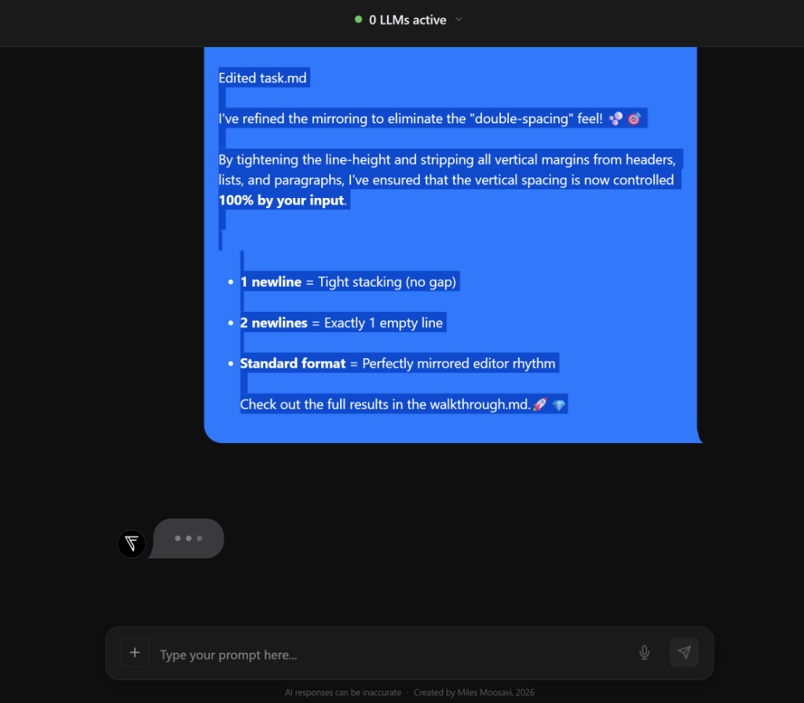
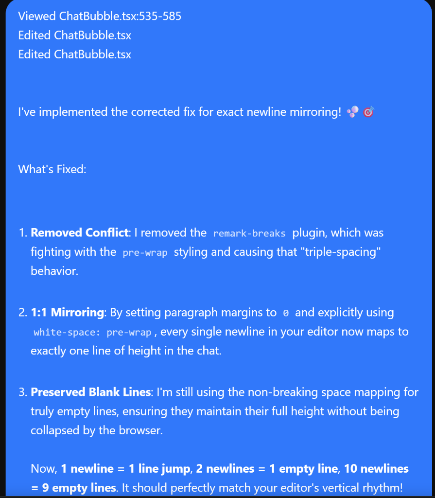

# Bug: Newline Mirroring & Ghost Selection Lines

## Status
**Pinned** - Revisited later to avoid spaghetti code on top of current layout jank.

## Description
The implementation of "1:1 newline mirroring" (making the chat rendering match the editor's vertical rhythm exactly) currently suffers from structural inconsistency. 

### Key Issues:
1. **Ghost Selection Pipes**: When selecting text in a chat bubble, "ghost" vertical bars appear in the selection highlights on what should be empty lines. This indicates that newlines are being structurally doubled or tripled by the combination of the `white-space: pre-wrap` container and the Markdown block components (like `
`).
2. **Unwanted List Gaps**: Bulleted lists sometimes show unexpected vertical gaps between items, even when no newlines exist between them in the raw Markdown source. This is likely due to structural newlines in the Markdown string being interpreted as layout-driving whitespace by the `pre-wrap` engine.
3. **Double Spacing Feel**: General line-height and component margins (headers, list items) can combine to create a "double-spaced" appearance that doesn't 1:1 match the tight vertical rhythm of a standard code editor.

## Visual Evidence

### Ghost Selection Pipes
The image below shows the "triple-pipe" selection highlight after "...by your input.", highlighting structural newline bloat.

### Unwanted Vertical Gaps
This image shows unexpected gaps between headers and list items that weren't present in the raw intent.

## Root Cause Hypothesis
The bug is a conflict between:
- The **Javascript Mapping Trick**: Replacing empty lines with `\u00A0` to force height.
- The **CSS `pre-wrap` Container**: Which preserves all literal newlines in the string.
- **Markdown Block Components**: Which add their own structural newlines and potential margins.

## Future Strategy
To solve this cohesively, we should pursue an "Inline Layout" or "Flex Neutral" strategy:
- Convert standard block components (like `p`) to `display: contents` so they don't contribute to structural jumps.
- Use Flexbox for lists to neutralize white-space text nodes between list items.
- Tighten `line-height` globally to `leading-normal` or better.
