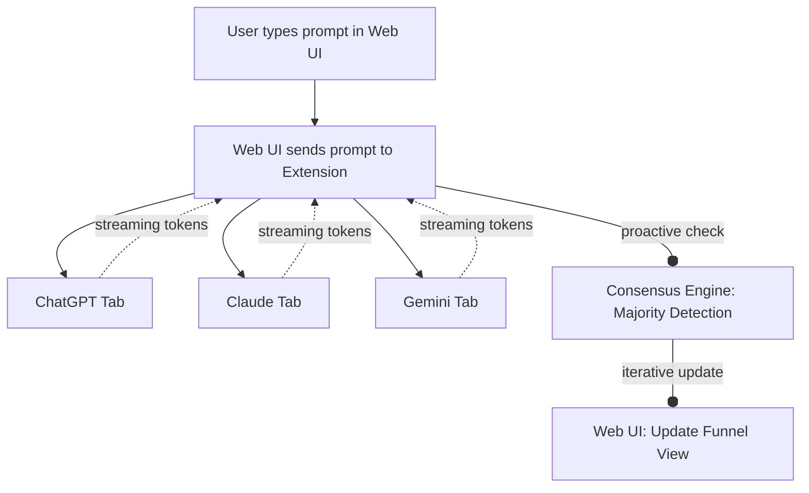

# Technical Architecture

## System Components

### 1. FunnelLM Web App (The Interface)

- **Stack**: Next.js (Vercel), Tailwind CSS, Framer Motion.
- **Rendering**: `react-markdown` with `remark-math` and `rehype-katex` for native LaTeX support.
- **Function**: The main command center. It stores conversation history, handles user accounts, and provides the "Group Chat" UI.
- **Communication**: Uses `chrome.runtime.sendMessage` (via `externally_connectable`) to talk to the extension.

### 2. Consensus Engine (The Brain)

- **Model**: A fast/cost-effective model (e.g., GPT-3.5 Turbo or Gemini Flash).
- **Consensus Modes**:
  - **Deterministic (Majority Vote) - [PRIMARY FOCUS]**: Automatically parses for `Answer:` labels or `\fbox{}`/`\boxed{}` markers. Designed specifically for Math and Multiple-Choice benchmarks to identify consensus before explanations are finished.
  - **Qualitative (Summarization) - [ROADMAP]**: Future capability to synthesize open-ended explanations and highlight discrepancies.
  - **Semantic Step Aggregation (Groupthink Pulse)**: Maps model-specific reasoning steps into unified objectives to show live progress.
- **Proactive Synthesis**: Does not wait for "All models idle." Starts generating the summary as soon as the first model reaches a terminal state or enough streaming data exists to establish a majority.

### 3. Chrome Extension (The Bridge)

- **Manifest V3**:
  - `content_scripts`: Injected into `chat.openai.com`, `claude.ai`, `gemini.google.com`.
  - `background_service_worker`: Orchestrates message passing between the Web App and the Content Scripts.
- **Permissions**: `tabs`, `storage`, `scripting`, `host-permissions` for the LLM domains.

### 4. High-Level Data Flow



### 5. Message Sequence (Real-time Streaming & Majority Vote Detection)

```mermaid
sequenceDiagram
    participant U as User
    participant W as Funnel Web UI
    participant E as Browser Extension
    participant T as LLM Tabs (Content Scripts)

    U->>W: Submit Prompt
    W->>E: chrome.runtime.sendMessage({prompt})

    rect rgb(30, 30, 30)
        Note over E,T: Parallel Execution
        E->>T: Dispatch CustomEvent to Tab
        T->>T: Background DOM Injection
    end

    loop Mutation Streaming
        T-->>E: Transmit current DOM text
        E-->>W: Update Individual LLM Message

        Note over E: Pattern Match Detected? (e.g., \fbox{})
        alt Majority Found
            E-->>W: Send Partial Consensus State
            W-->>W: Render "Preliminary Majority" Result
        end
    end

    Note over T,W: All Models Finished or Conflict Resolved
    E->>W: Trigger Final Synthesis (Consensus Engine)
    W->>W: Render Final Funnel Message + Breakdown Button
```



## cMoA (Client-side Mixture of Agents) Strategy

Unlike traditional MoA platforms that use a centralized cloud orchestrator, FunnelLM operates as a **Decentralized MoA** executing within the user's browser sandbox. This approach reduces server costs, empowers local execution, and utilizes existing client-side sessions to query multiple models concurrently.

### The Deterministic Arbiter

To enforce deterministic results quickly, the consensus engine relies on a non-blocking arbiter with **Early-Exit** capabilities. 

- **Stability Window**: Once a first model finishes, the Funnel waits ~3s before finalizing the UI to prevent result flickering as fast models arrive before slow models.
- **The "Tie-Breaker" Logic**: If models are deadlocked (e.g., 2v2 split), the arbiter falls back to a deterministic model priority tree (e.g., 1. Claude, 2. GPT) to provide an interim result, while simultaneously entering a "Split Decision" UI state to ask the user a clarifying question.
- **The "Quorum" Requirement**: A consensus is only "Confirmed" if at least 2 models agree. If only 1 model responds and the others time out, the Funnel renders a "Single Source" warning: "Majority could not be reached. Showing result from [Model Name] only."

```javascript
// Example: Majority Vote Arbiter
function calculateConsensus(modelResponses) {
    const tally = {};
    const threshold = Math.ceil(modelResponses.length / 2); // Quorum required

    for (let response of modelResponses) {
        const match = response.text.match(/Answer:\s*\[?([A-D])\]?/i) || 
                      response.text.match(/\\boxed\{([^}]+)\}/);
        
        if (match) {
            const val = match[1].toUpperCase();
            tally[val] = (tally[val] || 0) + 1;
            
            // Early Exit Triggered (subject to Stability Window)
            if (tally[val] >= threshold) {
                return { status: "CONFIRMED", winner: val, confidence: (tally[val]/modelResponses.length) };
            }
        }
    }
    return { status: "PENDING", tally }; // If tied or incomplete, wait or apply Tie-Breaker logic.
}
```

### Tab Exceptions & "The Nuclear Option"
- **The "Ghost Tab" Protocol**: If a stream is unresponsive for >15s due to throttling, or if the user accidentally closes an LLM tab mid-generation, the Extension emits a `TAB_EXCEPTION` signal. The model is dropped from the active denominator and marked **Offline**.
- **Cloudflare / Captchas**: If a tab hits a "Verify you are human" wall, the content script detects the blocking modal. The UI updates that model's avatar with a **"Tab Attention Required"** red pulsing ring, prompting the user to manually focus the tab.

## State Management & Handshake

- **Service Worker Authority**: The source of truth for the active "Consensus State" lives entirely within the Extension Background script (Service Worker). The Next.js Web UI is a thin, ephemeral client. If the user refreshes the page, the UI rehydrates its state seamlessly from the background script.
- **Auth Handshake**: The Web App transmits its current session UID to the Extension via `chrome.runtime.sendMessage` upon load. This ensures the background script knows exactly which user profile to sync the scraped chat data with.
- **Service Tokens**: No API keys are required for the LLMs themselves, as the extension utilizes the user's existing browser session cookies in the open tabs.
